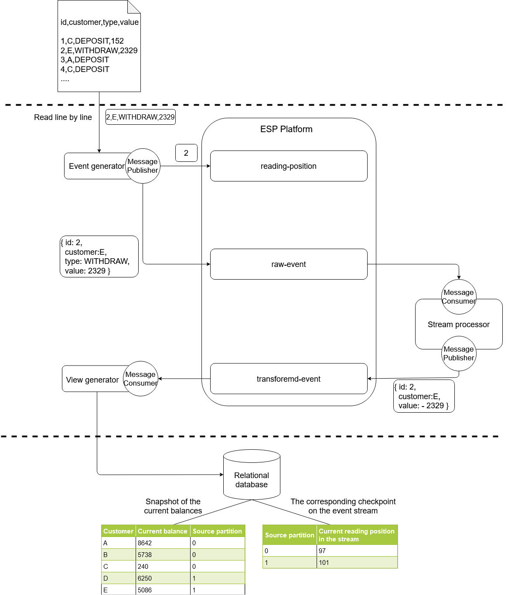
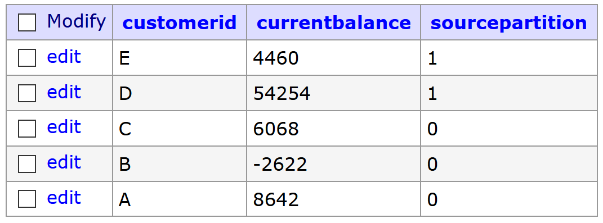

Delivery guarantees on ESP platforms
-----------------------------------

This is a part of the Master Thesis for the High Integrity Systems course at the Frankfurt University of Applied Sciences. A simple use case of banking transaction is implemented on three different Event Stream Processing (ESP) platforms: Apache Kafka, Apache Pulsar and NATS Streaming. Different failure scenarios are setup to inspect the highest level of delivery guarantee on these platforms.

Quickstart
~~~~~~~~~~

.Build the executable jar files from the root directory
----
mvn clean install
----

.Go to the Docker directory of a platform:

* For Kafka
----
cd kafka/docker
----

* For Pulsar
----
cd pulsar/docker
----

* For NATS Streaming
----
cd nats-streaming/docker
----

.Build the necessary Docker images
----
docker-compose build
----

.Start different scenarios:
* No failure scenario
----
./scenario-no-failure.sh
----

* Scenario with event generator crashes

----
./scenario-event-generator-crash.sh
----

* Scenario with stream processor crashes

----
./scenario-stream-processor-crash.sh
----

* Scenario with view generator crashes

----
./scenario-stream-aggregator-crash.sh
----

* Scenario with two consumers in the same group have the same messages (only Kafka and Pulsar)

----
./scenario-duplicated-producer.sh
----

The current balances on the PostgreSQL database can be inspected from the web browser under: http://localhost:8081 with the following login info:

* System: PostgreSQL
* Server: postgres_db
* Username: postgres
* Password: postgres
* Database: exactly-once

The current balance of customers are available in table `currentbalance`

The current reading position of the view generator on the source stream `transformed-event` is available in table `currentreadingposition`

.Stop the use case
----
docker-compose down
----

*Note:* Currently the scripts can only be executed directly on Windows machine. To execute on Linux machine, remove `winpty` from commands in the `setup.sh` script in the same folder.
